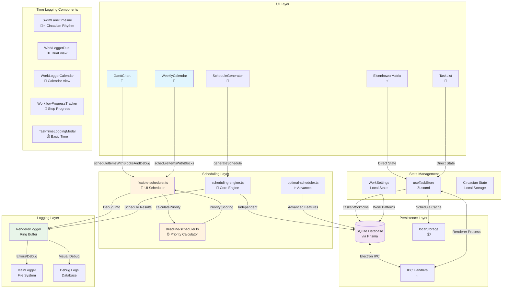

# 🏗️ Task Planner Architecture & Data Flow

## 📊 System Overview

This document maps the complete architecture of the Task Planner application, showing how data flows from UI components through schedulers to persistence layers.

## 🎨 Component Architecture



## ⏰ Time Logging Architecture

### Variety of Time Logging Systems
```
1. SwimLaneTimeline - Circadian rhythm tracking with energy levels
2. WorkLoggerDual - Side-by-side productivity analysis  
3. WorkLoggerCalendar - Calendar-based time visualization
4. WorkflowProgressTracker - Step-by-step workflow time tracking
5. TaskTimeLoggingModal - Basic task time entry
```

### Time Data Persistence Flow
```
Time Entry → Local State → IPC → Main Process → SQLite Database
                ↓              ↓
        Real-time UI Updates   Batch Persistence
                ↓              ↓  
        Circadian Analysis    Historical Reports
```

### HTML/DOM Structure
```
App Container
├── Navigation Sidebar
├── Main Content Area
│   ├── TaskList (Grid/List View)
│   ├── Timeline Views (Gantt/Calendar)
│   ├── Matrix Views (Eisenhower)
│   └── Time Logging Modals (Overlay)
├── Work Logger Panel
│   ├── SwimLane Timeline (Circadian)
│   ├── Dual View Logger
│   └── Progress Tracker
└── Debug Panels (Dev Mode)
```

## 🔄 Data Flow Patterns

### 1. Task Scheduling Flow (UI Components)

#### GanttChart & WeeklyCalendar
```
User Action → Component → flexible-scheduler → deadline-scheduler → Rendered Items
                              ↓                      ↓
                        Work Patterns          Priority Calculation
                              ↓                      ↓
                        Time Blocks            Deadline Pressure
                              ↓                      ↓
                        Scheduled Items       Enhanced Priority
```

**Key Points:**
- Both use `flexible-scheduler.ts` for actual scheduling
- `deadline-scheduler.ts` provides priority calculations
- Work patterns define available time blocks
- Results are rendered directly without database persistence

#### ScheduleGenerator
```
Generate Button → scheduling-engine → Database → UI Update
                        ↓
                  Topological Sort
                        ↓
                  Priority Ranking
                        ↓
                  Scheduled Result
```

**Key Points:**
- Uses `scheduling-engine.ts` (separate from UI schedulers)
- Persists results to database
- Different priority calculation algorithm

### 2. Priority Calculation Discrepancy

**CRITICAL ISSUE:** Two different priority systems exist:

#### UI Schedulers (flexible/deadline)
```typescript
// deadline-scheduler.ts (CURRENT BUG)
priority = eisenhower * deadlinePressure + asyncBoost
// Should be: priority = eisenhower + deadlinePressure * 100
```

#### Core Engine (scheduling-engine)
```typescript
// scheduling-engine.ts (FIXED)
priority = rawScore + (deadlinePressure > 1 ? deadlinePressure * 100 : 0)
```

### 3. Workflow Step Inheritance

```
Workflow (I:8, U:3)
    ↓
Step 1 (I:null, U:null) → Inherits (I:8, U:3)
Step 2 (I:5, U:null) → Uses (I:5, U:3)
```

**Current Implementation:**
- `flexible-scheduler`: Checks for null/undefined before inheriting
- `scheduling-engine`: Same inheritance logic
- `deadline-scheduler`: Handles inheritance in calculatePriorityWithBreakdown

## 💾 Persistence Strategy

### Database (Prisma/SQLite)
- **Stored:** Tasks, SequencedTasks, TaskSteps, Sessions, WorkSettings
- **When:** User saves, task updates, session changes
- **Access:** Via IPC handlers (main process)

### LocalStorage
- **Stored:** Cached schedules, UI preferences
- **When:** Temporary state, quick access needed
- **Access:** Direct from renderer process

### Ring Buffer (In-Memory)
- **Stored:** Recent logs (last 1000 entries)
- **When:** Continuous logging
- **Access:** Dev tools, error reports

## 🐛 Known Issues & Solutions

### Issue 1: Trader Joe's Task Scheduling
**Problem:** Task appears in wrong time slot despite low priority (P28)
**Root Cause:** 
1. UI uses different scheduler than debug info
2. Multiplicative deadline pressure formula
3. NULL inheritance not working

**Solution:**
```typescript
// Fix in deadline-scheduler.ts
const deadlineAdditive = deadlinePressure > 1 ? deadlinePressure * 100 : 0
const total = eisenhower + deadlineAdditive + asyncBoost
```

### Issue 2: Deadline Violations Not Visible
**Problem:** Tasks missing deadlines aren't visually obvious
**Solution:** Add visual indicators in GanttChart component

## 📡 IPC Communication Paths

```
Renderer Process          Main Process           Database
    ↓                         ↓                     ↓
useTaskStore ──IPC──> task-handlers ──Prisma──> SQLite
    ↑                         ↑                     ↑
  UI Updates <──IPC── Response Data <──Query── Results
```

## 🔍 Debug Information Flow

```
Scheduler Execution
        ↓
  Debug Info Object
        ↓
    [GANTT_ASCII]
        ↓
  RendererLogger → Ring Buffer
        ↓              ↓
  Console Output    Dev Tools
        ↓              ↓
  Main Logger    Debug Panel
        ↓
  File System
```

## 📈 Performance Considerations

1. **Scheduler Calls:** 
   - GanttChart/WeeklyCalendar call scheduler on every render
   - Consider memoization for expensive calculations

2. **Database Queries:**
   - All go through IPC (async overhead)
   - Batch operations when possible

3. **Logging:**
   - Ring buffer prevents memory leaks
   - Async file writes in main process

## 🎯 Next Steps

1. ✅ Unify scheduler implementations
2. ✅ Fix priority calculation formulas  
3. 🚧 Add visual deadline indicators
4. 🚧 Implement ASCII art debugging
5. 🚧 Persist debug logs to database

---

*Last Updated: 2025-09-04*
*Version: 1.0.0*